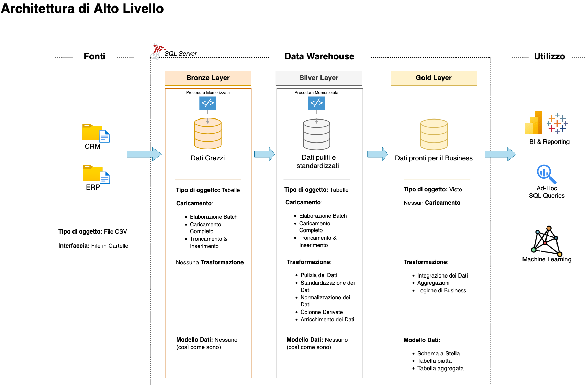

# Progetto Data Warehouse e Analytics

**Benvenuti nel repository del Progetto Data Warehouse e Analytics!** 🚀  
Questo progetto dimostra una soluzione completa di data warehousing e analisi, dalla costruzione di un data warehouse alla generazione di insight operativi. Progettato come portfolio, evidenzia le migliori pratiche del settore nell'ingegneria dei dati e nell'analisi.

---
## 📖 **Panoramica del Progetto**

Il progetto include:

1. **Architettura dei Dati**: Progettazione di un moderno data warehouse basato sulla **Medallion Architecture** (livelli **Bronze**, **Silver** e **Gold**).  
2. **Pipeline ETL**: Estrazione, trasformazione e caricamento dei dati dai sistemi sorgente al data warehouse.  
3. **Modellazione dei Dati**: Sviluppo di tabelle fatte e di dimensione ottimizzate per query analitiche.  
4. **Analisi & Reporting**: Creazione di report e dashboard in SQL per insight operativi.  

🎯 **Questo repository è una risorsa ideale per professionisti e studenti che vogliono dimostrare competenze in:**  
- Sviluppo SQL  
- Architettura dei Dati  
- Ingegneria dei Dati  
- Sviluppo di Pipeline ETL  
- Modellazione dei Dati  
- Analisi dei Dati  

---

## 🛠️ **Link e Strumenti Utili**  

**Tutto è gratuito!**  
- **[Dataset](datasets/):** Accesso ai dataset del progetto (file CSV).  
- **[SQL Server Express](https://www.microsoft.com/en-us/sql-server/sql-server-downloads):** Server leggero per ospitare il database SQL.  
- **[SQL Server Management Studio (SSMS)](https://learn.microsoft.com/en-us/sql/ssms/download-sql-server-management-studio-ssms?view=sql-server-ver16):** Interfaccia grafica per gestire e interagire con i database.  
- **[Repository Git](https://github.com/):** Configura un account GitHub per gestire, versionare e collaborare sul codice.  
- **[DrawIO](https://www.drawio.com/):** Strumento per progettare architetture, modelli e diagrammi di flusso.  
- **[Notion](https://www.notion.com/):** Piattaforma all-in-one per la gestione del progetto e l’organizzazione.  
- **[Fasi del Progetto su Notion](https://thankful-pangolin-2ca.notion.site/SQL-Data-Warehouse-Project-16ed041640ef80489667cfe2f380b269?pvs=4):** Accesso a tutte le fasi e i task del progetto.  

---

## 🚀 **Requisiti del Progetto**  

### **Costruzione del Data Warehouse (Ingegneria dei Dati)**  

#### Obiettivo  
Sviluppare un moderno data warehouse con SQL Server per consolidare i dati di vendita, abilitando reportistica analitica e decisioni informate.  

#### Specifiche  
- **Fonti Dati**: Importare dati da due sistemi sorgente (ERP e CRM) in formato CSV.  
- **Qualità dei Dati**: Pulizia e risoluzione di problematiche prima dell’analisi.  
- **Integrazione**: Unire le fonti in un modello dati unificato e ottimizzato per query analitiche.  
- **Ambito**: Utilizzare solo il dataset più recente (non è richiesta la storicizzazione).  
- **Documentazione**: Fornire una chiara documentazione del modello dati per stakeholder e team analitici.  

---

### **BI: Analisi & Reporting (Analisi dei Dati)**  

#### Obiettivo  
Sviluppare analisi SQL per generare insight dettagliati su:  
- **Comportamento dei clienti**  
- **Performance dei prodotti**  
- **Trend di vendita**  

Questi insight forniscono agli stakeholder metriche chiave per decisioni strategiche.  

Per maggiori dettagli, consulta [docs/requirements.md](docs/requirements.md).  

---
## 🏗️ **Architettura dei Dati**

L'architettura del progetto segue la **Medallion Architecture** con livelli **Bronze**, **Silver** e **Gold**:  


1. **Livello Bronze**: Memorizza i dati grezzi così come sono estratti dai sistemi sorgente. I dati vengono caricati da file CSV in un database SQL Server.  
2. **Livello Silver**: Include processi di pulizia, standardizzazione e normalizzazione per preparare i dati all'analisi.  
3. **Livello Gold**: Contiene dati modellati in uno schema a stella, pronti per reportistica e analisi.  

---

## 📂 **Struttura del Repository**
```

data-warehouse-project/
│
├── datasets/                           # Dataset grezzi utilizzati per il progetto (dati ERP e CRM)
│
│
├── docs/                               # Documentazione e dettagli architetturali
│   ├── etl.drawio                      # File Draw.io che illustra le tecniche ETL
│   ├── data_architecture.drawio        # File Draw.io dell'architettura del progetto
│   ├── data_catalog.md                 # Catalogo dei dataset con descrizioni e metadati
│   ├── data_flow.drawio                # Diagramma di flusso dei dati in Draw.io
│   ├── data_models.drawio              # Modelli dati (schema a stella) in Draw.io
│   ├── naming-conventions.md           # Linee guida per la nomenclatura di tabelle, colonne e file
│
├── scripts/                            # Script SQL per ETL e trasformazioni
│   ├── bronze/                         # Script per estrazione e caricamento dati grezzi
│   ├── silver/                         # Script per pulizia e trasformazione dati
│   ├── gold/                           # Script per creazione modelli analitici
│
├── tests/                              # Script di test e controllo qualità
│
├── README.md                           # Panoramica e istruzioni del progetto
├── LICENSE                             # Informazioni sulla licenza
├── .gitignore                          # File e cartelle ignorati da Git
└── requirements.txt                    # Dipendenze e requisiti del progetto

```
---

## 🛡️ **Licenza**


Questo progetto è distribuito con licenza [MIT](LICENSE). Puoi utilizzarlo, modificarlo e condividerlo con la giusta attribuzione.
